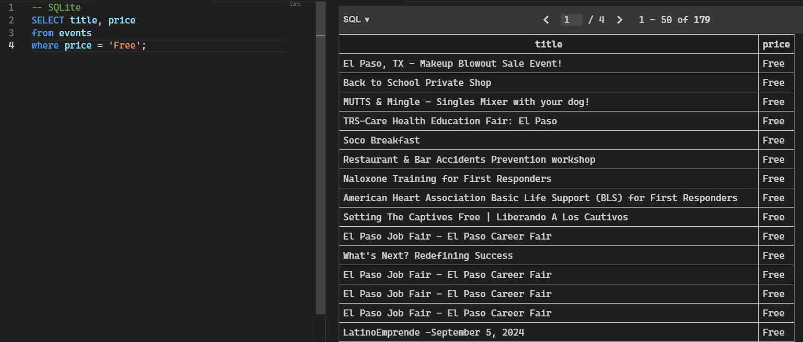

# Eventbrite CD Juárez Scraper

This project is a web scraping application designed to extract upcoming and already listed event data from Eventbrite in Ciudad Juárez, Mexico, and store it in a SQLite database. It is useful for anyone interested in analyzing events in this geographical area.

## Features

- **Event Scraping**: Extracts information on events such as title, date, location, and price.
- **SQLite Storage**: Stores the data in a SQLite database for easy access and querying.
- **Docker Execution**: The project is configured to run in a Docker container, ensuring portability and consistency across different environments.

## Project Structure

```plaintext
.
├── data                   # Directory for the SQLite database
├── .dockerignore          # Files and directories ignored by Docker
├── .gitignore             # Files and directories ignored by git
├── docker-compose.yml     # Docker Compose configuration
├── Dockerfile             # Docker image configuration
├── LICENSE                # Project license
├── README.md              # Project documentation
├── requirements.txt       # Python dependencies
└── scrape_events.py       # Main scraping script
```

## Installation and Execution

### Prerequisites

- [Docker](https://www.docker.com/get-started)
- [Docker Compose](https://docs.docker.com/compose/install/)

### Clone the Repository

```bash
git clone https://github.com/your-username/eventbrite-cdjuarez-scraper.git
cd eventbrite-cdjuarez-scraper
```

## Build and Run with Docker
To build the Docker image and see logs in real-time:
```bash
docker-compose up --build
```

Alternatively, you can run the containers in the background and then view the logs:

```bash
docker-compose up -d --build
docker-compose logs -f
```

## Run without Docker
If you prefer to run the project without Docker, follow these steps:

1. Install Python dependencies:

```bash
pip install -r requirements.txt
```

2. Run the scraping script:

```bash
python scrape_events.py
```

## Usage
The scrape_events.py script will scrape events and store the data in data/events.db. You can adjust the initial page number in the script if necessary.

## Example Output
The following image shows the output of the query to get free events:

